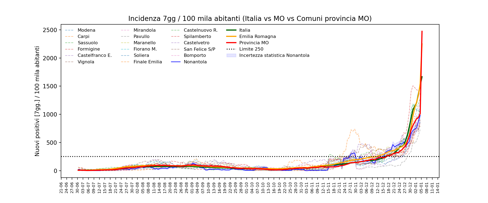

# Dati Covid-19


```python
import sys, glob
import pandas as pd
import numpy as np
from miscellanea import adatta_nome, importa_abitanti
```

### Dati nazionali, regionali, provinciali

Fonte dati: [Presidenza del Consiglio dei Ministri - Dipartimento della Protezione Civile](https://github.com/pcm-dpc)

Import dati nazionali e regionali


```python
dataset = 'https://raw.githubusercontent.com/pcm-dpc/COVID-19/master/dati-regioni/dpc-covid19-ita-regioni.csv'
df = pd.read_csv(dataset)
temp = df[['data','nuovi_positivi']].groupby(by='data').sum()
ita = pd.Series(data=temp.nuovi_positivi, index=pd.to_datetime(temp.index))

ita_abitanti = 59_641_488 # Fonte https://www.tuttitalia.it/regioni/popolazione/
```

Emilia Romagna


```python
temp = df[df.denominazione_regione=='Emilia-Romagna']
emr = pd.Series(data=temp.nuovi_positivi.values, index=pd.to_datetime(temp.data))

emr_abitanti = 4_464_119 # Fonte https://www.tuttitalia.it/regioni/popolazione/
```

Import dati provinciali


```python
dataset = 'https://raw.githubusercontent.com/pcm-dpc/COVID-19/master/dati-province/dpc-covid19-ita-province.csv'
df = pd.read_csv(dataset)
temp = df[df.denominazione_provincia=='Modena'][['data','totale_casi']]
mo = pd.Series(data=temp.totale_casi.diff().values.astype(int)[1:], index=pd.to_datetime(temp.data[1:]))
mo_abitanti = 707_119 # Fonte https://www.tuttitalia.it/emilia-romagna/provincia-di-modena/
```

### Dati provincia di Modena - dettaglio comuni

Import dei dati dai file con i nuovi positivi dal report dell'AUSL di Modena (recuperati dalle pagine di [sulpanaro.net](https://www.sulpanaro.net/))


```python
comuni = glob.glob('giornaliero/*.txt')

dlist=[]   # lista di dictionary che conterranno i dati dei comuni
daylist=[] # lista dei giorni (presi dal nome del file)
for file in comuni:
    with open(file) as f:
        d = {}
        for l in f.readlines():
            campi = l.rstrip().split(' ')
            
            # salta le linee vuote
            if len(campi[-1])==0:
                continue
            
            # se l'ultimo campo è un numero, associa quel numero alla stringa precedente (Comune)
            # altrimenti prendi tutta la linea come Comune e associa il nr 0
            if campi[-1].isdigit():
                comune = ' '.join(campi[:-1])
                nuovi  = campi[-1]
            else:
                comune = ' '.join(campi)
                nuovi  = 0
            
            comune = comune.rstrip().lstrip()
            comune = adatta_nome(comune)
            d[comune]=nuovi
            
        dlist.append(d)
        daylist.append(file.split('_')[-1].split('.')[0])

# crea dataframe
dayindex = pd.to_datetime(daylist, format='%d-%m-%Y')
df = pd.DataFrame(data=dlist, index=dayindex).sort_index()
df = df.fillna(0).astype(int)

```

Check sul contenuto del dataframe


```python
df.tail()
df.columns
```


    Index(['Castelfranco E.', 'Finale Emilia', 'Fiorano M.', 'Formigine',
           'Mirandola', 'Modena', 'Montese', 'Pievepelago', 'Fuori provincia',
           'Bastiglia', 'Bomporto', 'Campogalliano', 'Camposanto', 'Carpi',
           'Castelnuovo R.', 'Castelvetro', 'Cavezzo', 'Concordia', 'Fanano',
           'Fiumalbo', 'Frassinoro', 'Guiglia', 'Lama Mocogno', 'Maranello',
           'Marano', 'Medolla', 'Montecreto', 'Montefiorino', 'Nonantola', 'Novi',
           'Palagano', 'Pavullo', 'Prignano', 'Polinago', 'Ravarino', 'Riolunato',
           'San Cesario S/P', 'San Felice S/P', 'San Possidonio', 'San Prospero',
           'Sassuolo', 'Savignano S/P', 'Serramazzoni', 'Sestola', 'Soliera',
           'Spilamberto', 'Vignola', 'Zocca', 'TOTALE'],
          dtype='object')


Metti in evidenza date mancanti (per recuperare i dati man mano) isolando le date che distano più di un giorno dalla precedente


```python
giorni = pd.Series(df.index, index=df.index).diff()
for g in zip(giorni[giorni>pd.to_timedelta('1 day')].index, giorni[giorni>pd.to_timedelta('1 day')].values):
    print(f"{g[0].date()} --> mancano {g[1]/1e9 /3600/24 - 1 } giorni precedenti")
```

    2020-09-20 --> mancano 4 giorni precedenti
    2020-09-23 --> mancano 1 giorni precedenti
    2020-09-26 --> mancano 2 giorni precedenti
    2020-10-03 --> mancano 5 giorni precedenti
    2020-10-06 --> mancano 1 giorni precedenti
    2020-10-11 --> mancano 3 giorni precedenti
    2020-10-14 --> mancano 1 giorni precedenti
    2020-10-26 --> mancano 8 giorni precedenti
    2020-11-02 --> mancano 6 giorni precedenti
    2020-11-09 --> mancano 6 giorni precedenti
    2020-11-16 --> mancano 5 giorni precedenti
    2020-11-27 --> mancano 1 giorni precedenti
    2020-12-05 --> mancano 2 giorni precedenti
    2020-12-07 --> mancano 1 giorni precedenti
    2020-12-11 --> mancano 3 giorni precedenti
    2020-12-15 --> mancano 1 giorni precedenti
    2020-12-22 --> mancano 1 giorni precedenti
    2020-12-24 --> mancano 1 giorni precedenti
    2020-12-27 --> mancano 1 giorni precedenti
    2020-12-29 --> mancano 1 giorni precedenti
    2020-12-31 --> mancano 1 giorni precedenti
    2021-01-08 --> mancano 2 giorni precedenti
    2021-02-09 --> mancano 1 giorni precedenti


## Nuovi positivi

Leggi i dati degli abitanti dei comuni nella provincia di Modena da [qui](https://www.tuttitalia.it/emilia-romagna/provincia-di-modena/70-comuni/popolazione/) (aggiornato a 31/12/2019 - dati ISTAT)


```python
abitanti = importa_abitanti('abitanti_provincia_di_Modena.txt')
```

Aggiungi abitanti provincia, regione, nazione


```python
abitanti['Emilia Romagna'] = emr_abitanti
abitanti['Italia'] = ita_abitanti
abitanti['Provincia MO'] = mo_abitanti
```

Timeline su intervallo 7gg.


```python
roll = df.rolling(7, center=True).sum()
ita_roll = ita.rolling(7, center=True).sum()
emr_roll = emr.rolling(7, center=True).sum()
mo_roll = mo.rolling(7, center=True).sum()
```

## Salva report dati

Report in diversi formati per altri usi (<font color=red>da aggiornare ogni giorno</font>).

Nuovi positivi divisi per comune (tutte le date disponibili) - **EXCEL**


```python
df.to_excel('report_vari/nuovi_positivi_comuni_MO.xlsx')
roll.to_excel('report_vari/nuovi_positivi_rolling7gg_comuni_MO.xlsx')
```

File separati per comune con dati positivi, somma mobile 7gg. e stessa somma rapportata a 100mila abitanti - **EXCEL** e **CSV**


```python
lista_output = [ comune for comune in df.columns if (comune!='Fuori provincia')&(comune!='TOTALE') ]

for comune in lista_output :
    nome_file = comune.replace(' ','').replace('.','').replace('/','') # crea nomi di file semplici
    temp_df = pd.concat((df[comune], roll[comune], roll[comune]/abitanti[comune]*100000), axis=1)
    temp_df.columns = ['nuovi pos.', 'somma mobile 7gg.', 'somma mobile 7gg. per 100mila abitanti']
    temp_df.to_excel('report_vari/comuni/' + nome_file + '.xlsx')
    temp_df.to_csv('report_vari/comuni/' + nome_file + '.csv')
```

## Grafici

### Nonantola

Comuni con cui confrontare


```python
lista_comuni = ['Carpi',
    'Sassuolo',
    'Formigine',
    'Castelfranco E.',
    'Vignola',
    'Mirandola',
    'Pavullo',
    'Maranello',
    'Fiorano M.',
#     'Nonantola',
    'Soliera',
    'Finale Emilia',
    'Castelnuovo R.',
    'Spilamberto',
    'Castelvetro',
    'San Felice S/P',
    'Bomporto',
    'Novi']
# per vedere elenco completo scommentare qui
#sorted(list(df.columns))
```

Dal 1 gennaio in poi


```python
range_temporale = '2021-01'
```


```python
import matplotlib.dates as mdates
import matplotlib.pyplot as plt

#plt.style.use('dark_background')
plt.style.use('fast')
# plt.style.use('fivethirtyeight')
# plt.style.use('seaborn-deep')
# plt.style.use('seaborn-dark-palette')

fig, ax = plt.subplots(figsize=(12,5), dpi=200)

xfmt = mdates.DateFormatter('%d-%m')
xloc = mdates.HourLocator(interval=24*2)
ax.xaxis.set_major_formatter(xfmt)
ax.xaxis.set_major_locator(xloc)
ax.tick_params(axis='x', rotation=45)

ax.set_title('Incidenza 7gg / 100 mila abitanti (Italia vs MO vs Comuni provincia MO)')
ax.set_ylabel('Nuovi positivi [7gg.] / 100 mila abitanti')

for k in lista_comuni:
    toplot = roll[k]/abitanti[k]*100000
    ax.plot(toplot[range_temporale:], 
#              drawstyle='steps',
            alpha=0.5, lw=0.4, label=k
           )
    
# Nonantola
toplot = roll['Nonantola']/abitanti['Nonantola']*100000
ax.plot(toplot[range_temporale:], alpha=1, lw=1, color='blue', label='Nonantola')

# # Soliera
# toplot = roll['Soliera']/abitanti['Soliera']*100000
# ax.plot(toplot[range_temporale:], alpha=1, lw=3, color='Magenta', label='Soliera')

# Nonantola, banda incert. statistica    
toplot_inf = (roll['Nonantola'] - np.sqrt(roll['Nonantola'])) / abitanti['Nonantola']*100000
toplot_sup = (roll['Nonantola'] + np.sqrt(roll['Nonantola'])) / abitanti['Nonantola']*100000
ax.fill_between(toplot_inf[range_temporale:].index, 
                toplot_sup[range_temporale:],
                toplot_inf[range_temporale:],
                alpha=0.1, color='blue',
               label='Incertezza statistica Nonantola')

# Screening scuole del 19 febbraio --> impattano dal giorno 19 - 3 = 16
propfrecce = dict(arrowstyle='-|>', color='k', connectionstyle = "angle,angleA=0,angleB=90,rad=0")

ax.annotate('Screening scuole 19 febbraio\n268 tamponi, 6 positivi (2.2%)', (pd.to_datetime('2021-02-16'), 580), xytext=(-350, -40), textcoords='offset points', 
            arrowprops=propfrecce,
            bbox=dict(facecolor='none', edgecolor='black', boxstyle='round,pad=1'),
               color='k')

## Nazione, Regione, Provincia
toplot = ita_roll/abitanti['Italia']*100000
ax.plot(toplot[range_temporale:], alpha=1, lw=1, color='darkgreen', label='Italia')
toplot = emr_roll/abitanti['Emilia Romagna']*100000
ax.plot(toplot[range_temporale:], alpha=1, lw=1, color='orange', label='Emilia Romagna')
toplot = mo_roll/abitanti['Provincia MO']*100000
ax.plot(toplot[range_temporale:], alpha=1, lw=1, color='red', label='Provincia MO')

plt.legend(ncol=5, fontsize=8, frameon=False)
#plt.legend(bbox_to_anchor=(1.05, 1), loc='upper left', ncol=1, fontsize=8)

plt.show()
fig.savefig('Nonantola.png')
fig.savefig('Nonantola.pdf')
```





```python

```
