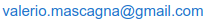
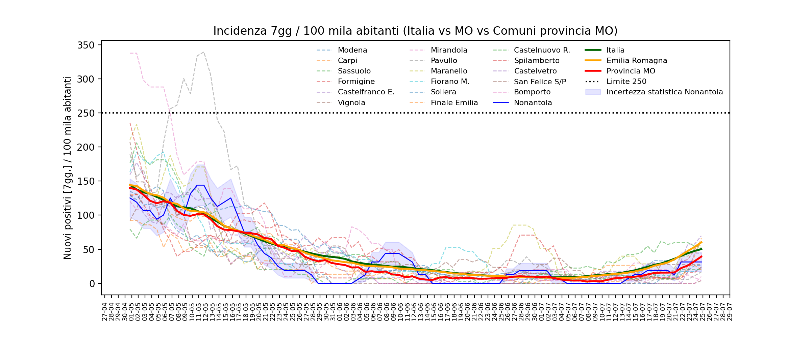
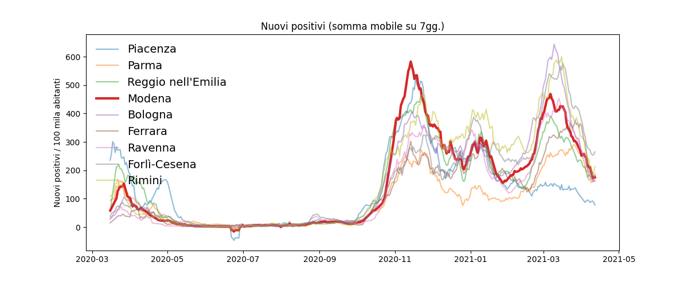

# Dati Covid19 provincia di Modena 

La repository contiene i dati dei **nuovi positivi** della provincia di Modena divisi per comune. I dati sono ricavati dalle pubblicazioni giornaliere del sito di  [sulpanaro.net](sulpanaro.net) ([qui](https://www.sulpanaro.net/2021/02/aggiornamento-coronavirus-28-2-nel-modenese-402-nuovi-casi/) ad esempio il report del 28/02), che a sua volta riporta il bollettino quotidiano emesso dall'AUSL di Modena non distribuito pubblicamente.

Nell'attesa che l'AUSL pubblichi uno storico strutturato e attendibile, ho deciso di raccolgiere i dati e metterli a disposizione.

Per qualsiasi richiesta o suggerimento: 

## Report disponibili

In [report_vari](./report_vari) si trovano:

* **nuovi_positivi_comuni_MO** ([xlsx](./report_vari/nuovi_positivi_comuni_MO.xlsx), [csv]((./report_vari/nuovi_positivi_comuni_MO.csv))): nuovi positivi per ogni giorno per tutti i comuni della provincia
* **nuovi_positivi_rolling7gg_comuni_MO** ([xlsx](./report_vari/nuovi_positivi_rolling7gg_comuni_MO.xlsx), [csv]((./report_vari/nuovi_positivi_rolling7gg_comuni_MO.csv))): incidenza 7gg. dei dati di cui sopra

In [report_vari/comuni](./report_vari/comuni) si trovano i report (Excel e csv) di tutti i comuni della provincia di Modena con i dati in 4 colonne:
    
    1. data
    2. nuovi positivi
    3. somma mobile 7gg.
    4. somma mobile 7gg./100mila abitanti

#### Intervallo date

da: 01/09/2020 a: 04/03/2021

#### Giorni mancanti
    
1. 06/02/2021

#### Ultimo aggiornamento

👉 `04/03/2021 18:20`

## Fonte e aggiornamento

La cartella [giornaliero](./giornaliero) contiene i dati di partenza. Si tratta di un file di testo per ogni giorno e corrisponde al testo pubblicato ogni giorno dal quotidiano [SulPanaro](https://www.sulpanaro.net/) preso dai bollettini AUSL. In alcuni casi questo è stato fatto con degli screenshot e nella sotto cartella [foto_trascritte](./giornaliero/foto_trascritte) si trova la corrispondente immagine.

Dopo aver creato un nuovo file in questo cartella l'aggiornamento di tutti i report avviene usando lo script `salva_report.py`

### Grafici

L'idea di questa raccolta dati nasce da una discussione su un gruppo FB di Nonantola a proposito di un grafico che un consigliere comunale ha mostrato per mettere in evidenza l'aumento dei contagi a Nonantola rispetto al trend provinciale/regionale/nazionale. 

Nel far notare i limiti di quella visualizzazione, ho pensato di poter continuare quel lavoro raccogliando tutti i dati disponibili.

Questo è un grafico di esempio che riguarda appunto Nonantola. Il [Jupyter notebook](CovidNonantola_contesto.ipynb) usato per produrlo contiene anche le info sulla lettura dei dati e il modo in cui sono stati trattati.

### Emilia Romagna

Andamento dei positivi settimanali (somma mobile 7gg rapportata a 100 mila abitanti) per le province.
[Notebook](plot_provincia.ipynb).

